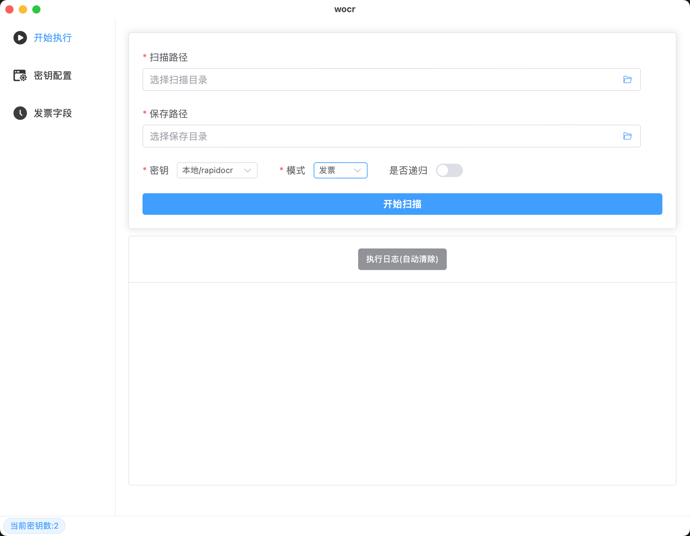

# README

## 项目介绍

集成云厂商的 OCR API 的桌面工具。

目前支持识别的功能：

- 发票
- VIN码
- 行程单
- 车牌

支持的云厂商厂商：
- 百度云
- 腾讯云
- 阿里云
- 部分本地

## 界面



## Mac-OS文件损坏

```sh
# 终端执行
sudo xattr -dr com.apple.quarantine /Applications/wocr.app
```
